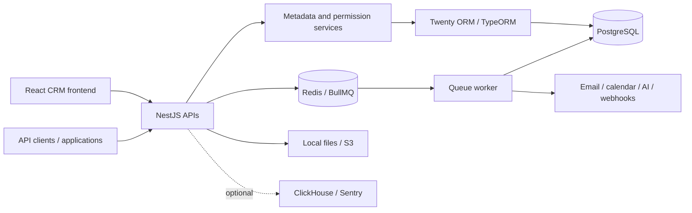

# Codebase evaluation

Reviewed on 2026-09-14 at commit `7d34959ca9`. See [baseline and authority](README.md) and [verification evidence](DEVELOPMENT.md).

## 1. Executive summary

The repository is a substantial Twenty CRM codebase. It provides customizable CRM records, metadata-defined objects and fields, workflows, messaging/calendar synchronization, dashboards, AI capabilities, and an application extension platform.

The review inspected representative implementation paths across startup, APIs, workspace isolation, authentication, permissions, configuration, background processing, integrations, and deployment. Supporting packages were mapped. This was not a line-by-line audit of every module or a penetration test.

Both main application typechecks passed. The backend formatting check passed across 8,064 files. Earlier environment setup had demonstrated login and a Companies page containing demo data. No full automated test suite or external integration was validated during the review.

Assessment: suitable for continued local exploration and targeted development testing. Full integration coverage, production behavior, and a fork-owned deployment process remain unverified. No project files, dependencies, or database records were changed during the original review.

## 2. Technology stack

Versions below are manifest declarations unless explicitly identified as local runtime versions. They are not a complete lockfile inventory or a claim about current upstream releases.

| Area | Technologies |
| --- | --- |
| Workspace | Nx 22.7.8, Yarn 4.13.0, Node 24; local runtime Node 24.16.0 |
| Languages | TypeScript/TSX, JavaScript, SQL, shell scripts; Python execution support |
| CRM frontend | React 19.2, Vite 8, Apollo Client 4, Jotai, Linaria, Lingui |
| Backend | NestJS 11.2, Express, GraphQL Yoga, GraphQL 16 |
| Persistence | PostgreSQL, patched TypeORM 0.3.31, custom Twenty ORM |
| Jobs/cache | BullMQ 5.78, Redis |
| Observability | Optional ClickHouse, Sentry, logging and metering drivers |
| Website | Next.js 16.2, React 19, Cloudflare/OpenNext scripts |
| Checks | TypeScript 5.9, native TypeScript preview (`tsgo`), Jest, Vitest, Playwright, Oxlint, Oxfmt |
| Infrastructure | Docker Compose, Helm/Kubernetes, Terraform, GitHub Actions |

Nest GraphQL and TypeORM have repository patches. Review patch intent and compatibility before changing either dependency. The native TypeScript checker is a preview dependency; do not silently substitute a different compiler and assume identical results.

Primary manifests: [root](../../package.json), [frontend](../../packages/twenty-front/package.json), [backend](../../packages/twenty-server/package.json), [website](../../packages/twenty-website/package.json).

## 3. Architecture and data flow

The product uses a modular NestJS backend and a separate worker process, with shared packages in the monorepo.

### Startup and frontend state

[Server bootstrap](../../packages/twenty-server/src/main.ts) creates the Nest application and configures request parsing, CORS, sessions, file uploads, exception handling, proxy trust, and the listening port. It calls frontend-configuration generation, so starting the application is not a read-only operation.

[AppModule](../../packages/twenty-server/src/app.module.ts) assembles GraphQL, REST, MCP, middleware, core modules, workspace infrastructure, and optional static frontend serving. The [worker entry point](../../packages/twenty-server/src/queue-worker/queue-worker.ts) creates a Nest application context and enables shutdown hooks. The [command entry point](../../packages/twenty-server/src/command/command.ts) uses nest-commander and closes the application afterward.

The frontend hydrates metadata from IndexedDB before rendering. `App`, `DomainShell`, and `WorkspaceAppProviders` establish localization, Jotai state, workspace selection, authentication, Apollo clients, server-sent events, notifications, and agent chat. Record tables/views, settings, workflow tooling, and dashboards use the shared metadata model.

Separate Apollo clients target `/graphql` for CRM records, `/metadata` for platform/metadata operations, and `/admin-panel` for administration. The application shell distinguishes root-domain and workspace contexts.

### Persistence and relationships

The implementation separates core platform entities from workspace CRM records:

- The PostgreSQL `core` schema contains users, workspaces, memberships, metadata, and related platform entities.
- Workspace schema names are derived from workspace UUIDs by [getWorkspaceSchemaName](../../packages/twenty-server/src/engine/workspace-datasource/utils/get-workspace-schema-name.util.ts).
- Metadata describes objects, fields, relationships, indexes, and permissions, influencing both API schemas and UI behavior.
- Users relate to workspaces through `userWorkspace`. Companies have people and opportunities; records relate to tasks, notes, attachments, and timeline entries.
- The custom ORM loads workspace authentication, metadata, and permission context. Repository/query infrastructure includes object permissions and row-level filtering.

[Core datasource configuration](../../packages/twenty-server/src/database/typeorm/core/core.datasource.ts) disables TypeORM automatic synchronization and automatic migration execution. Legacy TypeORM migrations coexist with newer versioned instance/workspace upgrade commands. Inspect [upgrade instructions](../../packages/twenty-server/docs/UPGRADE_COMMANDS.md) before planning schema changes. The review inspected schema implementation, not a complete live database catalog or all deployed migration cursors.

### Authentication, authorization, and request handling

Implemented authentication capabilities include passwords, Google/Microsoft OAuth, SAML/OIDC, two-factor authentication, invitations, session cookies, and access/API tokens. Configuration determines which are available.

Verified controls include bcrypt password hashing; HTTP-only session cookies; secure-cookie behavior tied to deployment configuration; origin checks for unsafe cookie-authenticated requests; workspace authentication middleware; REST guards; resolver validation pipes; authentication throttling; and GraphQL query-size/introspection protections.

[REST controllers](../../packages/twenty-server/src/engine/api/rest/core/controllers/rest-api-core.controller.ts) dispatch generic CRUD, batch, duplicate-detection, grouping, restoration, and merge operations through handlers and common query runners. Record authorization must remain enforced below the UI. Inspect guards, metadata permissions, and repository/query behavior together when changing an endpoint.

### Workers and external services

The [queue explorer](../../packages/twenty-server/src/engine/core-modules/message-queue/message-queue.explorer.ts) discovers processors and creates workers, respecting queue inclusion/exclusion configuration. [Cron registration](../../packages/twenty-server/src/database/commands/cron-register-all.command.ts) is a separate command. Jobs include messaging/calendar imports, workflow scheduling, stale-run recovery, cleanup, domain checks, subscription renewal, and signing-key rotation.

| Capability | Verified implementation support |
| --- | --- |
| Transactional email | SMTP or a logger driver |
| Messaging/calendar | Google, Microsoft, and IMAP/SMTP/CalDAV-related modules |
| Storage | Local filesystem or S3, wrapped by storage validation |
| Billing | Stripe; raw-body webhook signature verification |
| AI | OpenAI, Anthropic, Google, Azure, Bedrock, Mistral, xAI, compatible providers |
| Code interpreter | Disabled, local Python, or E2B drivers |
| Extensions | Application SDK, logic functions, webhooks, MCP, integration applications |

Support in code does not establish that an integration is enabled, licensed, credentialed, or functional in this environment.

## 4. Repository map

| Location | Purpose |
| --- | --- |
| `package.json`, `yarn.lock`, `nx.json` | Dependencies, workspaces, tasks, caching |
| `CLAUDE.md`, `AGENTS.md`, `.cursor/rules/` | Contributor and agent guidance |
| `packages/twenty-front` | CRM browser application |
| `packages/twenty-server/src/engine` | APIs, authentication, metadata, permissions, ORM, infrastructure |
| `packages/twenty-server/src/modules` | CRM business modules |
| `packages/twenty-server/src/database` | Datasources, initialization, migration/upgrade commands |
| `packages/twenty-server/src/queue-worker` | Background worker |
| `packages/twenty-server/src/command` | Administrative command runner |
| `packages/twenty-shared`, `twenty-utils` | Shared contracts and utilities |
| `packages/twenty-ui`, `twenty-front-component-renderer` | UI library and extension rendering |
| `packages/twenty-sdk`, `twenty-client-sdk`, `create-twenty-app` | App SDK/CLI, API clients, scaffolding |
| `packages/twenty-apps`, `twenty-zapier` | Extension apps and integration tooling |
| `packages/twenty-emails` | Email templates |
| `packages/twenty-e2e-testing` | Browser tests |
| `packages/twenty-oxlint-rules` | Architectural lint rules |
| `packages/twenty-website`, `twenty-docs` | Website and documentation |
| `packages/twenty-claude-skills`, `twenty-codex-plugin` | Agent integration packages; inspect their scoped instructions |
| `packages/twenty-cli` | Legacy CLI package, explicitly marked deprecated |
| `packages/twenty-docker`, `.github` | Infrastructure definitions and CI/CD |
| `.devenv` (ignored) | Existing local Docker configuration and runtime logs |

## 5. Core modules

| Module | Responsibility and dependencies |
| --- | --- |
| Workspace/platform | Lifecycle, memberships, onboarding, domains; core persistence and configuration |
| Metadata | Objects, fields, indexes, views, app definitions; drives schemas and rendering |
| Permissions | Roles, settings/object/field permissions, row predicates; identity and metadata |
| CRM records | Companies, people, opportunities, workspace members; workspace ORM |
| Collaboration | Notes, tasks, attachments, timeline; relationships to CRM records |
| Messaging/calendar | Connected accounts, synchronization, participants, webhooks; OAuth, queues, providers |
| Workflows | Triggers, actions, execution and recovery; CRM services, queues, integrations |
| AI/applications | Agents, providers, tools, app lifecycle and logic functions; permissions and execution drivers |
| Dashboards/emailing | Reporting, dashboard synchronization, campaigns and reconciliation |
| Billing/enterprise | Subscriptions, entitlements, enterprise features; configuration/license dependent |

## 6. Findings and follow-up register

All entries were open at the baseline. Priorities are review recommendations, not confirmed exploit severity ratings.

| ID | Finding / evidence | Implication and recommended follow-up |
| --- | --- | --- |
| R01 | [Docker entrypoint](../../packages/twenty-docker/twenty/entrypoint.sh) continues after upgrade failure and later prints success | High operational priority: make partial upgrade state observable and define startup policy; test failed upgrade behavior in an isolated environment |
| R02 | [Main CD](../../.github/workflows/cd-deploy-main.yaml) and [tag CD](../../.github/workflows/cd-deploy-tag.yaml) dispatch to `twentyhq/twenty-infra` | High onboarding priority: establish fork-owned deployment targets before enabling deployment |
| R03 | [Email logger](../../packages/twenty-server/src/engine/core-modules/email/drivers/logger.driver.ts) logs full message bodies | Authentication links and personal information can reach logs; review driver selection, access, and retention |
| R04 | [Local interpreter](../../packages/twenty-server/src/engine/core-modules/code-interpreter/drivers/local.driver.ts) executes unsandboxed Python; its factory disallows it in production | Keep development execution isolated; verify driver and environment classification before exposure |
| R05 | Core datasource uses dotenv `override: true` | File values can override injected environment settings; document and verify effective precedence without displaying secrets |
| R06 | Root guidance says React 18; manifests specify React 19.2. Server example includes `PORT`; bootstrap reads `NODE_PORT` | Correct stale setup assumptions when updating relevant documentation |
| R07 | Local/standard Compose uses PostgreSQL 16; inspected integration CI uses PostgreSQL 18 and ClickHouse | Add isolated environment-parity checks before relying on local results |
| R08 | REST retains undocumented `PUT` update alias; company retains deprecated `addressOld`; legacy CLI marked deprecated | Compatibility debt: identify consumers before removing or replacing paths |
| R09 | [Oxlint migration notes](../../packages/twenty-oxlint-rules/OXLINT_MIGRATION_TODO.md) record disabled rules and lost plugin coverage | Review rule configuration and restore coverage intentionally; historical violation counts were not revalidated |
| R10 | Settings permission guard allows specific workspace creation states | Appears intentional for onboarding; regression-test state transitions and reachable endpoints. No authorization exploit established |

Other verified defenses include outbound HTTP IP/DNS checks against private/link-local destinations and raw-body Stripe signature verification. Coverage across all call sites was not proven.

Assessment: dynamic metadata, custom ORM behavior, permission enforcement, and versioned upgrades are the main sources of architectural complexity. Custom dependency patches and legacy compatibility paths increase maintenance work. No current dependency-advisory audit, exhaustive duplicate-code analysis, production configuration audit, or complete integration test run was performed. Do not convert these unknowns into claims of safety or vulnerability.
